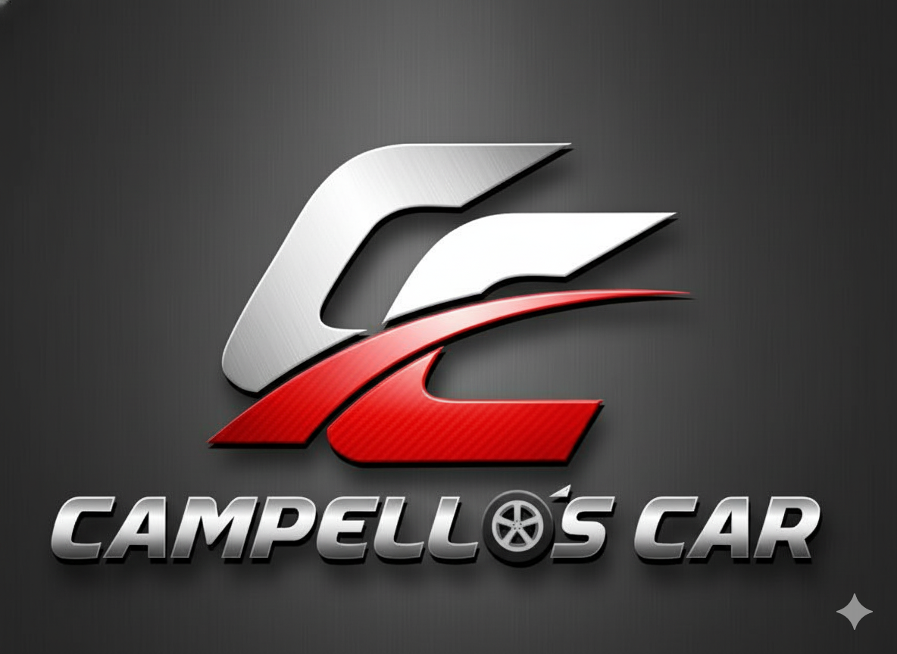

# Lab DIO - Natty or Not: Showcase de IA Generativa

## 📒 Descrição

Este projeto é minha submissão para o Lab "Natty or Not" da DIO. Para demonstrar o poder e a versatilidade das IAs Generativas, criei um portfólio de assets 100% artificiais:

1.  **Um E-book:** Sobre o tema "O uso de IA para venda de carros", explorando a linha tênue entre o real e o artificial.
2.  **Um Logo:** A identidade visual de uma marca de carros de luxo fictícia, a "Campello's Car".
3.  **Uma Animação de Vídeo:** Um comercial cinematográfico de 12 segundos para o logo "Campello's Car".

O objetivo é mostrar como a IA pode ser usada tanto para criar conteúdo (texto) quanto para assets de marca realistas (logo e vídeo).

## 🤖 Tecnologias Utilizadas

* **ChatGPT (OpenAI):** Usado para escrever e formatar o e-book completo "O uso de IA para venda de carros".
* **Google Gemini (com Modelo Imagen):** Usado para gerar o logo 3D da "Campello's Car".
* **Google Veo (via Gemini):** Usado para interpretar um prompt de cena complexo e gerar a animação de vídeo cinematográfica.

## 🧐 Processo de Criação

O projeto foi dividido em três partes, cada uma com seu próprio prompt:

### 1. E-book (com ChatGPT)
Usei um prompt para gerar o conteúdo completo do e-book:
> "Escreva um e-book chamado 'Natty or Not: A Nova Era da IA'. O tom deve ser misterioso e instigante, questionando o que é real e o que é artificial."

### 2. Logo "Campello's Car" (com Gemini)
Usei um prompt para criar a identidade visual da marca, focando em um design automotivo de luxo.

### 3. Vídeo Animação (com Gemini/Veo)
Este foi o prompt mais complexo, detalhando 4 cenas, iluminação, câmera e som para criar um comercial realista:

> ```
> 🚗 Prompt VEO 3 — Logo Animation “Campello’s Car”
> 
> Title: Cinematic Logo Animation — Campello’s Car
> Duration: 12 seconds
> Aspect Ratio: 16:9
> Style: realistic, cinematic, luxury car brand commercial, metallic reflections, red and silver lighting, elegant camera movements, epic music soundtrack.
> 
> ⸻
> 
> 🎬 Scene 1 (0s–3s) — INTRO
> Visual: Dark metallic background...
> 
> ⸻
> 
> 🎬 Scene 2 (3s–7s) — LOGO FORMATION
> Visual: Silver metallic shapes begin to emerge...
> 
> ⸻
> 
> 🎬 Scene 3 (7s–10s) — TEXT REVEAL
> Visual: The camera pulls back to reveal...
> 
> ⸻
> 
> 🎬 Scene 4 (10s–12s) — OUTRO
> Visual: The complete logo shines in the center...
> ```

## 🚀 Resultados

Abaixo estão os três assets finais 100% gerados por IA.

### 1. Logo da Marca "Campello's Car"


### 2. E-book "Natty or Not: A Nova Era da IA"
* **[Clique aqui para ler o E-book (PDF)](projetos/Natty_or_Not_A_Nova_Era_da_IA%20-%20ChatGPT.pdf)**

### 3. Animação de Vídeo "Campello's Car"
* **[Clique aqui para assistir ao vídeo (video.mp4)](projetos/video.mp4)**

## 💭 Reflexão

Foi incrível ver como, em poucos minutos, consegui criar um e-book, um logo e um vídeo que parecem profissionais. Principalmente o vídeo: se eu não falasse, ninguém acreditaria que foi feito por IA, o que prova o ponto do desafio "Natty or Not". A complexidade do prompt de vídeo que a IA foi capaz de interpretar é impressionante.